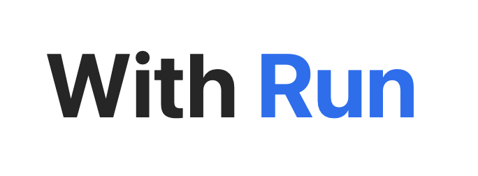
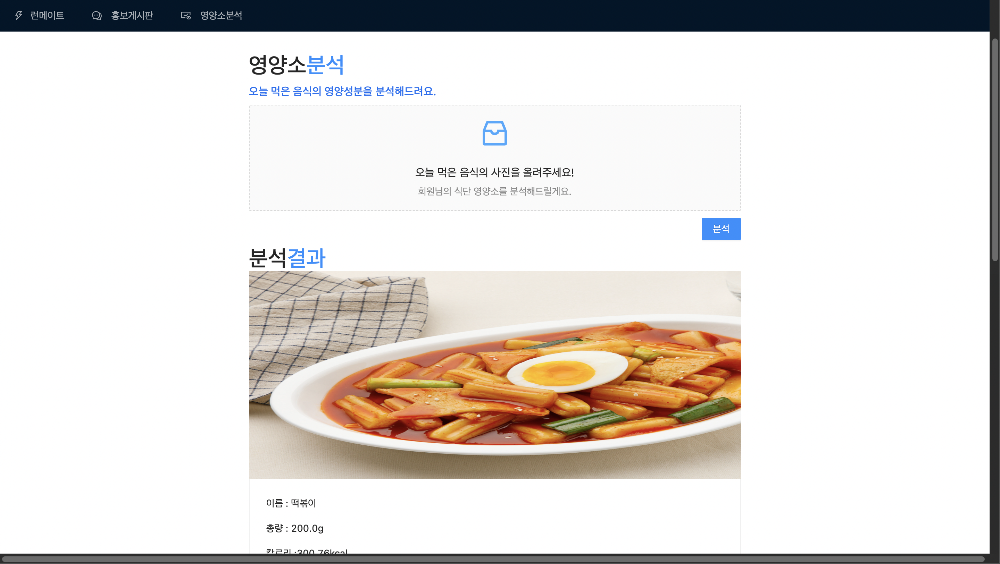

  

# ❄️ WithRun의 Front-end 레포지토리입니다.

**🧿 런메이트 매칭과, 크루를 홍보하고 멤버를 모집하는 서비스** 

> 위치기반서비스를 이용하여, 가까운 동네에서 함께 뛸 수 있는 사람을 구할 수 있으며  
> 런닝 크루를 운영하고 있는 경우 본인의 크루를 홍보하여 멤버를 모집할 수 있습니다.   

## ❄️ Period  
2021.10~ 진행중!  

## ❄️ Members
**M17 팀**  
> 미디어학과 17학번끼리 팀이 되어 M17 이라는 팀명을 지었습니다.  
> '미디어프로젝트'의 주제로 이를 선정하여 아이디어를 공유하며 서비스를 기획하고 제작하게 되었습니다.  
* 최현욱 (팀장, BACK-END)  
[visit github](https://github.com/chu9741)  
* 김승민 (FRONT-END)  
[visit github](https://github.com/turfguy)  


## ❄️ Technology used  

  *  Next.js  
        - 리액트 기반의 프레임워크로, 리액트의 단점을 보완해주는 부분이 많아서 선택하였습니다.  
        - 특히나, SSR과 SEO 때문에 선택하게 되었습니다.  
            ✔️page-based routing system  
            ✔️SSG / SSR  
            ✔️Fast Refresh  
  
  * ant-desgin  
    - 완성도 높은 UI 프레임워크  
    - 강력한 브라우징 호환성, UX에 입각한 컴포넌트 구성  
    - 빠른 레이아웃 구성 가능   
  
## ❄️ 주요기술 
* 로그인 & 회원가입
  
    
    
  


* 런메이트 구인  
    
  - 사용자들이 글을 작성하면, 각 사용자의 현재위치에 게시글이 연동됩니다.
  - 이를 통해 가까운 지역에서 런메이트를 구할 수 있습니다.

* 홍보 게시판  
    
  - 런닝크루에 속해있는 사용자의 경우, 본인의 런닝 크루를 어필하여 회원을 모집할 수 있습니다.
  - 런닝크루에 들어가고 싶은 회원은 게시판을 보고 가입을 신청할 수 있습니다.

* 영양소 분석  
  
  - 오늘 먹은 음식의 사진을 업로드하면, 음식의 이름/양/영양성분들을 표시해주는 서비스입니다.
  - 이를 통해 본인의 식단을 관리할 수 있습니다.
  - YOLO v3 Model을 이용해, 음식을을 탐지합니다.
  - 음식양 추정은, Classification Model 중 Resnet을 사용하였습니다.


## ❄️ How to process 
* Running front-end
```bash
# intall
$ npm install -g create-next-app
# make my project
$ npx create-next-app my-app
# start project
$ npm run dev

```
## 🌈Contact
-최현욱: chu9741@ajou.ac.kr  
-김승민: ksm0811@ajou.ac.kr  
